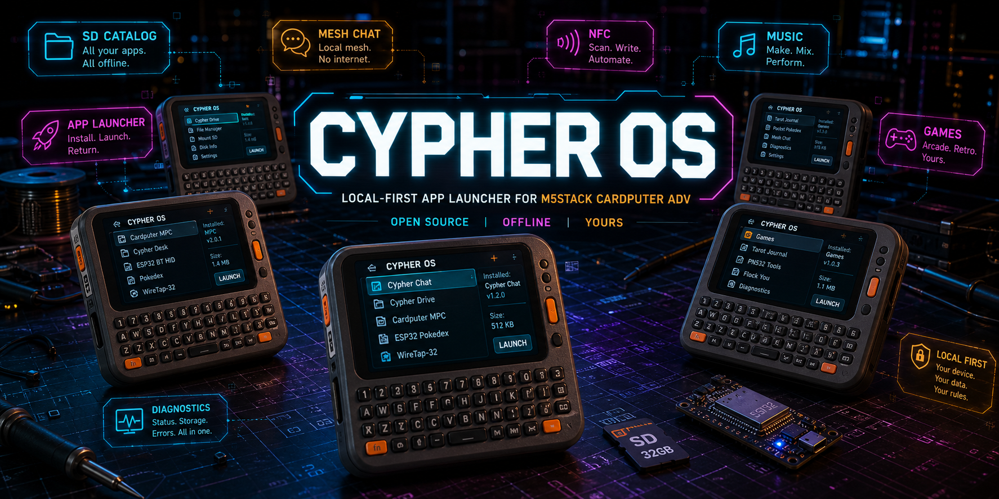

<p align="center">
  
</p>

<h1 align="center">Cypher OS</h1>

<p align="center">
  <strong>A local-first app deck for the <a href="https://amzn.to/4dqii8h">M5Stack Cardputer ADV</a>.</strong>
</p>

<p align="center">
  <a href="https://github.com/dkyazzentwatwa/cypher-puter-os/releases/latest"></a>
  
  
  
  
</p>

<p align="center">
  <a href="#install-from-a-release">Install</a>
  ·
  <a href="#current-app-lineup">Apps</a>
  ·
  <a href="#build-and-package-sd-apps-locally">Build</a>
  ·
  <a href="#controls">Controls</a>
  ·
  <a href="docs/README.md">Docs</a>
</p>

Cypher OS turns the [M5Stack Cardputer ADV][cardputer-affiliate] into a
pocket-sized launcher for real Cardputer apps. Flash the launcher once, copy a
release SD bundle, then swap between tools, games, music, chat, storage, and
field utilities without doing a USB reflash every time you want to change what
the device does.

It feels like a tiny handheld OS, but it stays honest about the hardware:
ESP32 apps do not execute directly from SD. Cypher OS keeps a small launcher in
the primary app slot, installs the selected app `.bin` from the SD catalog into
the app partition, then reboots into that app. When the app supports return,
you come back to the launcher and pick the next thing.

## At A Glance

| You Get | Details |
| --- | --- |
| **Flash once, swap often** | Install app binaries from SD instead of reflashing over USB for every app change. |
| **Public release bundle** | Each GitHub release ships the launcher `.bin`, SD card zip, generated catalog, and build report. |
| **Local catalog** | No cloud feed, no online OTA, no account, no remote dependency. |
| **Return-to-launcher flow** | Supported apps can reboot back into Cypher OS when you are done. |
| **Diagnostics screen** | See SD mount state, app count, installed app, app slot size, selected binary size, and last install error. |
| **Arduino CLI only** | Small, scriptable, and intentionally scoped to Cardputer ADV. |

## Why It Rules

- **One Cardputer, many personalities.** Carry a launcher, groovebox, secure
  chat tool, offline desk kit, arcade catalog, tarot journal, detector build,
  and bench utility on one SD card.
- **No cloud catalog. No online dependency.** The whole flow is local: build
  apps, package the SD card, boot the launcher, pick what you want.
- **Made for repeat use.** Apps can return to Cypher OS instead of turning the
  workflow into flash-once-and-done firmware.
- **Small launcher, big catalog.** The launcher stays focused on browsing,
  installing, launching, diagnostics, and recovering from the SD app catalog.
- **Purpose-built for [Cardputer ADV][cardputer-affiliate].** No generic board
  matrix, no stretched scope, no pretending this is a multi-platform firmware
  framework.

## Current App Lineup

These are the supported Cardputer app targets in the current catalog flow:

| App | What It Adds |
| --- | --- |
| **[Cypher Drive][cypher-drive-repo]** | [Cardputer ADV][cardputer-affiliate] HID payload launcher build. |
| **[ESP32 BT HID][esp32-bt-hid-repo]** | BLE-HID payload deck with SD-backed DuckyScript payloads and a Wi-Fi editor. |
| **[ESP32 Pokedex][esp32-pokedex-repo]** | Offline Pokemon GO field guide that uses your existing SD data and sprites. |
| **[Cypher Chat][cypher-chat-repo]** | Secure-only mesh chat build using protocol `0x02` with AES-256-GCM. |
| **[Cardputer Games][cardputer-games-repo]** | Standalone Cardputer arcade catalog. |
| **[Cardputer MPC][cardputer-mpc-repo]** | MPC-style groovebox with SD-loaded samples and sequencing. |
| **[Cardputer Tarot][cardputer-tarot-repo]** | Offline tarot pull, journal, history, and study deck app. |
| **[Cypher PN532][cypher-pn532-repo]** | PN532 NFC toolkit for the [Cardputer ADV][cardputer-affiliate] EXT I2C header. |
| **[Cypher Desk][cypher-desk-repo]** | Offline utility suite with notes, calculator, checklist, converters, and scratchpad. |
| **[Flock You][cypher-flock-repo]** | [Cardputer ADV][cardputer-affiliate] WiFi/BLE detector build with return-to-launcher support. |
| **[WireTap-32 Cardputer][wiretap-32-repo]** | [Cardputer ADV][cardputer-affiliate] EXT bench build with return-to-launcher support. |
| **[Cardputer Game OS games][cardputer-game-os-repo]** | Individual game `.bin` files imported from the sibling `cardputer-game-os` repo when present and built successfully. |

`starbeam_v2` is not part of the Cypher OS app catalog.

## App Docs

For deeper notes on each app, controls, SD paths, return behavior, and imported
game manuals, see [docs/README.md](docs/README.md).

## How Launching Works

Cypher OS uses a compact local OTA-slot model:

- The launcher lives in `ota_0`.
- SD app binaries live under `/cypher-puter/apps`.
- Choosing an app copies that app `.bin` into `ota_1`.
- The device restarts into the installed app.
- Supported apps can set a one-shot return flag and restart back to the
  launcher menu.

Use sketch app `.bin` files, not merged flash images. The launcher checks for
oversized binaries and rejects merged images before writing.

## Hardware

- [M5Stack Cardputer ADV][cardputer-affiliate]
- FAT32 SD card, preferably 32 GB or smaller
- Apps stored under `/cypher-puter/apps`

## Responsible Use

Cypher OS is for local, authorized hardware, NFC, wireless, and embedded-device
work. Use the apps only with devices, cards, networks, and systems you own or
have clear permission to test. The SD catalog is intentionally local-first and
does not include an online payload or OTA feed.

## Install With Codex Or Claude Code

If you use Codex or Claude Code on the machine connected to your Cardputer ADV,
you can hand the agent this repo and ask it to perform the release install. The
agent should use this repo's Arduino CLI workflow, keep the target hardware as
Cardputer ADV, and avoid adding PlatformIO, ESP-IDF project files, online OTA,
or multi-board scope.

Copy/paste prompt:

```text
Install Cypher OS on my M5Stack Cardputer ADV from the latest GitHub release.
Use the release launcher bin and SD card zip, flash the launcher through the
repo helper when a /dev/cu.usbmodem* port is present, and tell me exactly what
you copied to the SD card. Do not change firmware or rebuild unless the release
assets are unavailable.
```

For a local source build instead, use:

```text
Build and package this exact Cypher OS checkout for the M5Stack Cardputer ADV.
Run arduino-cli compile --profile adv ., then ./tools/build-apps.sh and
./tools/package-sd.sh. Use ./tools/flash-launcher.sh /dev/cu.usbmodemXXXX for
flashing. Keep the repo Arduino CLI only.
```

## Install From A Release

Official public builds are shipped through [GitHub Releases][latest-release].
Grab the newest `v*` release when you want the stable public bundle.

Each tagged release publishes exactly four public assets:

| Asset | Use It For |
| --- | --- |
| `cypher-os-launcher.bin` | Flash this launcher firmware to the Cardputer ADV. |
| `cypher-os-sd-card.zip` | Unzip this directly to the root of a FAT32 SD card. |
| `apps.json` | Inspect the generated public catalog without opening the SD zip. |
| `BUILD_REPORT.md` | Check app build status, binary sizes, source commits, and packaging notes. |

Quick install flow:

```text
1. Flash cypher-os-launcher.bin
2. Unzip cypher-os-sd-card.zip to a FAT32 SD card
3. Insert SD card
4. Boot Cardputer
5. Pick an app from the Cypher OS catalog
```

Release asset names:

```text
cypher-os-launcher.bin
cypher-os-sd-card.zip
apps.json
BUILD_REPORT.md
```

The SD zip is packaged so its contents land directly at the SD root:

```text
/cypher-puter/apps/apps.json
/cypher-puter/apps/*.bin
/cardputer-mpc/
/cypher-drive/
/cardputer-game-os/saves/
```

ESP32 Pokedex ships as an app binary in the Cypher OS release bundle, but its
larger data, sprite, and optional audio folders still live at the app's
documented SD paths: `/pokemon`, `/audio`, and `/config`.

## Catalog Model

`config/apps.json` is the human source of truth for the public catalog: app
names, slugs, binary names, public repo URLs, local default paths, build
profiles, SD paths, return behavior, and release flags.

Generated manifests live under `dist/`:

```text
dist/apps/apps.json
dist/sd-card/cypher-puter/apps/apps.json
dist/BUILD_REPORT.md
```

Do not edit generated manifests by hand. Update `config/apps.json`, rebuild the
apps, and let the tools regenerate release output.

## Build And Flash The Launcher Locally

Build with the [Cardputer ADV][cardputer-affiliate] profile:

```bash
cd cypher-puter-os
arduino-cli compile --profile adv .
```

Or use the helper:

```bash
./tools/build-launcher.sh
```

The canonical profile is in `sketch.yaml`:

```text
m5stack:esp32:m5stack_cardputer:FlashSize=8M,PartitionScheme=custom,CDCOnBoot=cdc,USBMode=hwcdc
```

Flash with the local helper:

```bash
arduino-cli board list
./tools/flash-launcher.sh /dev/cu.usbmodemXXXX
```

If you omit the port, the script uses the first `/dev/cu.usbmodem*` port it
finds, touches it at 1200 baud, waits for re-enumeration, then uploads with the
`adv` profile.

## Build And Package SD Apps Locally

Build the app binaries and package the SD card folder:

```bash
./tools/build-apps.sh
./tools/package-sd.sh
```

Build just one app while developing:

```bash
./tools/build-apps.sh --app cypher-chat
./tools/build-apps.sh --app esp32-pokedex
./tools/build-apps.sh --app cypher-desk
```

Prepare the same artifact set used by official releases:

```bash
./tools/prepare-release.sh v0.1.0
```

Official GitHub releases are created by pushing a version tag:

```bash
git tag v0.1.0
git push origin v0.1.0
```

Then copy the contents of:

```text
dist/sd-card
```

to the root of a FAT32 SD card.

Expected SD layout:

```text
/cypher-puter/apps/apps.json
/cypher-puter/apps/cardputer-games.bin
/cypher-puter/apps/cardputer-mpc.bin
/cypher-puter/apps/cardputer-tarot.bin
/cypher-puter/apps/cypher-pn532.bin
/cypher-puter/apps/cypher-desk.bin
/cypher-puter/apps/cypher-chat.bin
/cypher-puter/apps/cypher-drive.bin
/cypher-puter/apps/esp32-bt-hid.bin
/cypher-puter/apps/esp32-pokedex.bin
/cypher-puter/apps/flock-you.bin
/cypher-puter/apps/wiretap-32-cardputer.bin
/cypher-puter/apps/<cardputer-game-os-game>.bin
/cardputer-mpc/
/cypher-drive/payloads/
/cardputer-game-os/saves/
```

ESP32 Pokedex uses SD data already stored at `/pokemon`, `/audio`, and
`/config`; the Cypher OS package only includes the app `.bin` and catalog
entry.

The catalog imports individual game `.bin` files from the sibling
`cardputer-game-os` repo. The nested Game OS launcher itself is not packaged
because Cypher OS already owns the launcher partition.

Cypher Chat is built from the sibling `cypher-chat/cypher-chat-firmware` sketch
with `BOARD_PROFILE_CARDPUTER_ADV`. Its mesh protocol is secure-only `0x02`, so
all fleet devices need matching firmware.

## Workspace Layout

The app scripts default to sibling repos beside this checkout:

Source repositories: [Cardputer MPC][cardputer-mpc-repo],
[Cypher Chat][cypher-chat-repo], [Cardputer Games][cardputer-games-repo],
[Cypher Drive][cypher-drive-repo], [Cardputer Tarot][cardputer-tarot-repo],
[ESP32 BT HID][esp32-bt-hid-repo], [ESP32 Pokedex][esp32-pokedex-repo],
[Cypher PN532][cypher-pn532-repo], [Cypher Desk][cypher-desk-repo],
[Cypher Flock][cypher-flock-repo],
[WireTap-32][wiretap-32-repo], and
[Cardputer Game OS][cardputer-game-os-repo].

```text
GitHub/
  cypher-puter-os/
  cardputer-games/
  cardputer-mpc/
  cardputer-tarot/
  cypher-pn532/
  cardputer-game-os/
  cypher-chat/
  cypher-drive/
  ESP32_BT_HID/
  esp32-pokedex/
  cypher-desk/
  flock-you/
  WireTap-32/
```

For a different layout, set a workspace root:

```bash
CYPHER_OS_WORKSPACE_ROOT=/path/to/repos ./tools/build-apps.sh
```

You can also override individual app paths:

```bash
CYPHER_OS_CARDPUTER_MPC_DIR=/path/to/cardputer-mpc ./tools/package-sd.sh
CYPHER_OS_CARDPUTER_TAROT_DIR=/path/to/cardputer-tarot ./tools/build-apps.sh
CYPHER_OS_CYPHER_PN532_DIR=/path/to/cypher-pn532 ./tools/build-apps.sh
CYPHER_OS_ESP32_BT_HID_DIR=/path/to/ESP32_BT_HID ./tools/build-apps.sh
CYPHER_OS_ESP32_POKEDEX_DIR=/path/to/esp32-pokedex ./tools/build-apps.sh
CYPHER_OS_CYPHER_DESK_DIR=/path/to/cypher-desk ./tools/build-apps.sh
```

## Controls

- `,` or `;`: up
- `.` or `/`: down
- `W/S` and `K/J`: up/down alternatives
- `Enter` or BtnA: select
- Backtick, `Del`, `Tab`, or `Q`: back
- `R`: reload SD catalog
- The launcher plays short procedural cues for movement, select, back, toggles,
  and warnings. Use Settings -> Sound effects to turn them on or off.
- Settings includes Boot behavior, Brightness, Sound effects, Theme, and Reload
  SD catalog.
- The Theme setting cycles through built-in launcher themes stored in firmware:
  Neon Grid, Terminal, Amber CRT, Synthwave, and Ice. The selected theme is saved
  in Preferences and does not require an SD theme file.
- In packaged apps, use the app's **Return to Launcher** item or `Del/Q` where
  shown. The app restarts, sets a one-shot return flag, and the launcher stays
  on the menu instead of auto-launching again.
- Cardputer MPC: use `Shift+Q` to return to Cypher OS. Lowercase `q` remains an
  MPC pad trigger.
- Cypher PN532: use the `Return to Cypher OS` main-menu item or press
  `Del`, `Tab`, backtick, or `Q` from the main menu.
- ESP32 BT HID: press backtick, `Esc`, or `Del` from the top-level device list
  to return to Cypher OS.
- ESP32 Pokedex: choose `Return to Cypher OS` from the home menu.
- Flock You: open the mini menu, cycle to `HOME`, then press up/down to return.
- WireTap-32: choose `Launcher` from the main menu, or type `launcher` /
  `return` over serial.

## Serial Commands

```text
help
status
apps
reload
launch
erase
install <slug>
```

## Technical Notes

- This repo is Arduino CLI only.
- Target hardware is the [M5Stack Cardputer ADV][cardputer-affiliate].
- The supported launch model is local SD catalog install into the app
  partition, then reboot.
- Keep the launcher small and local: no online OTA catalog, WebUI, USB mass
  storage, multi-board ports, PlatformIO, or ESP-IDF project files.
- The shared data partition is LittleFS so Cypher Drive can mount its log/config
  storage when launched from this OS.
- `Boot behavior` can auto-try the installed app on power-up or always stop at
  the launcher menu.
- Cypher PN532 expects a PN532 module in I2C mode on the [Cardputer ADV][cardputer-affiliate] EXT
  header: VCC to pin 6 `5VOUT`, GND to pin 4 `GND`, SDA to pin 8 `G8`, and SCL
  to pin 10 `G9`; leave PN532 RESET, INT, and BUSY unconnected for this build.

[cardputer-affiliate]: https://amzn.to/4dqii8h
[cardputer-game-os-repo]: https://github.com/dkyazzentwatwa/cardputer-game-os
[cardputer-games-repo]: https://github.com/dkyazzentwatwa/cardputer-games
[cardputer-mpc-repo]: https://github.com/dkyazzentwatwa/cardputer-mpc
[cardputer-tarot-repo]: https://github.com/dkyazzentwatwa/cardputer-tarot
[cypher-chat-repo]: https://github.com/dkyazzentwatwa/cypher-chat
[cypher-desk-repo]: https://github.com/dkyazzentwatwa/cypher-desk
[cypher-drive-repo]: https://github.com/dkyazzentwatwa/cypher-drive
[cypher-flock-repo]: https://github.com/dkyazzentwatwa/cypher-flock
[cypher-pn532-repo]: https://github.com/dkyazzentwatwa/cypher-pn532
[esp32-bt-hid-repo]: https://github.com/dkyazzentwatwa/ESP32_BT_HID
[esp32-pokedex-repo]: https://github.com/dkyazzentwatwa/esp32-pokedex
[latest-release]: https://github.com/dkyazzentwatwa/cypher-puter-os/releases/latest
[wiretap-32-repo]: https://github.com/dkyazzentwatwa/WireTap-32
